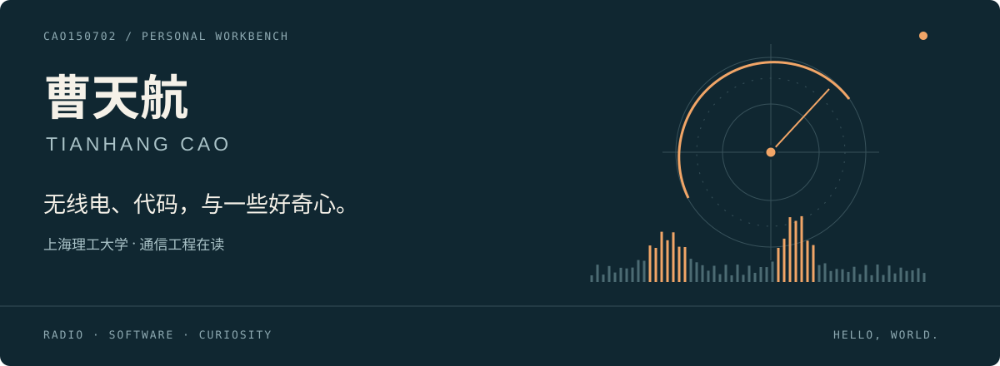

  

  <b>你好，我是天航。</b> 欢迎来到我的个人工作台。

  <a href="#-正在折腾">正在折腾</a> · <a href="#-作品橱窗">作品橱窗</a> · <a href="#-一路走来">一路走来</a> · <a href="mailto:15048094700@163.com">打个招呼</a>

## 📡 正在折腾

我在上海理工大学读通信工程。从机器人、模型比赛，到无线电、家庭网络和软件项目，兴趣一直在往外长。喜欢动手试，也喜欢看一个想法慢慢变成能用的东西。

<table>
<tr>
<td width="50%" valign="top">
<h3>01 / 无线电与网络</h3>

数字中继、SDR、家庭网络，还有设备之间的连接。遇到问题就查资料、看日志、做实验，在折腾中学习。

DMR · SDR · Home Lab

</td>
<td width="50%" valign="top">
<h3>02 / 软件与 AI</h3>

在酷爱科技实习，参与 Simi / OrgOS 相关工作。也用 AI 辅助开发个人作品，继续补齐编程与系统基础。

AI applications · Tools · Side projects

</td>
</tr>
</table>

## 🧩 作品橱窗

<table>
<tr>
<td width="50%" valign="top">
<h3><a href="https://github.com/Cao150702/portapack-dmr-monitor">PortaPack DMR Monitor ↗</a></h3>

<b>把集群信令变成能随身查看的业务活动。</b>

在 HackRF / PortaPack 上开发 DMR 监听插件，围绕站点、信道与呼叫观察组织信息，记录现场活动，回来继续分析。

手持集群观察 · 业务状态 · 记录回顾

</td>
<td width="50%" valign="top">
<h3><a href="https://github.com/Cao150702/pi-mmdvm-trunking">树莓派 + MMDVM 集群站点 ↗</a></h3>

<b>用小型硬件平台，跑真实终端的集群流程。</b>

围绕 DMR Tier III 推进平台适配与互通实验，已有终端登记、业务授权和单站组呼语音上行记录。

集群站点实验 · 终端互通 · 持续开发

</td>
</tr>
<tr>
<td colspan="2" valign="top">
<h3><a href="https://github.com/Cao150702/pintu-public">拼途 · Pintu ↗</a></h3>

找回曾经的那个未来。用切割、旋转与拼接，走过一段几何叙事。

交互作品 · 公开项目介绍

</td>
</tr>
</table>

<a href="https://github.com/Cao150702?tab=repositories">逛逛其他仓库 →</a>

## 🛠️ 工作台的其他角落

- **家庭网络**：R5S 软路由、DDNS、SMB，以及日常服务的部署与调试。
- **设备与自动化**：iOS 设备控制尝试、OCR 日程工具、基于 Docker / MQTT 的设备接入。
- **产品与画面**：做过景区系统原型，也喜欢摄影、视频剪辑和作品的视觉呈现。
- **日常工具**：Git、Xcode、Python，以及 Claude Code / Codex 等 AI 辅助工具。工具会变，想做的东西也会继续长出来。

## 🌱 一路走来

**2026 — 现在** · 在酷爱科技实习，接触 AI 应用与实际项目。  
**2025 — 现在** · 上海理工大学本科在读，继续探索通信和软件。  
**2023** · 在清华同衡参与原型设计与项目资料整理。  
**更早一些** · 机器人、航模、编程比赛，和第一个用 Python 写的小工具。

<b>展开看看：早期作品与比赛足迹</b>

### 二次根式化简

初中时用 Python 写过二次根式化简程序，尝试把递归过程改成非递归实现。它也是早期参加编程与科技活动的一段经历。

### 比赛记录

| 时间 | 奖项 |
| --- | --- |
| 2024.12 | 第 39 届呼伦贝尔市青少年科技创新大赛青少年创意编程一等奖 |
| 2021.09 | 首届呼伦贝尔市青少年机器人竞赛 / 第二届呼伦贝尔市青少年创意编程与智能设计大赛 Python 创意编程初中组优秀奖 |
| 2020.11 | 海拉尔区第五中学第七届校园科技节科技创意作品竞赛一等奖 |
| 2020.10 | 2020 年呼伦贝尔市公民科学素质大赛优秀团队奖 |
| 2020.09 | 2020 呼伦贝尔市青少年航海、航空航天、车辆、建筑模型教育竞赛优胜奖 |
| 2020.08 | 2019-2020 学年度海五中“民族团结先进个人”称号 |
| 2020.07 | 第二届内蒙古自治区中小学电脑制作活动初中组人工智能二等奖 |
| 2020.06 | 第二届国际青少年编程竞赛金奖 |
| 2020.05 | 第 35 届内蒙古自治区青少年科技创新大赛青少年科技创新成果竞赛二等奖 |
| 2019.11 | 第三十五届呼伦贝尔市青少年科技创新大赛青少年科技创新成果（初中）个人一等奖 |
| 2019.10 | 2019 年海拉尔区第七届青少年科技创新大赛二等奖 |
| 2019.07 | 2019 年呼伦贝尔市青少年航空、航海车辆模型竞赛第一名 |
| 2019.06 | 2019 呼伦贝尔市航海模型、建筑模型教育竞赛一等奖、二等奖、优胜奖 |
| 2018.12 | 首届内蒙古自治区中小学生人工智能及创客教育装备技术应用创新实践活动机器人技能 WER 能力挑战赛小学组冠军 |
| 2018.07 | 2018 年全国青少年户外体育活动营地夏令营（完成全部学习任务） |
| 2018.05 | 第 18 届内蒙古自治区青少年机器人竞赛 WER 工程创新赛小学组二等奖 |
| 2017.11 | WER2017 赛季世界锦标赛三等奖 |
| 2017.08 | 全国航海模型运动竞赛一等奖、二等奖、优胜奖 |
| 2017.07 | 2017 年呼伦贝尔市青少年航海模型选拔赛小学组第二名、第三名 |

---

<b>欢迎聊无线电、聊作品，也聊还没做出来的想法。</b>

<a href="mailto:15048094700@163.com">15048094700@163.com</a> · <a href="https://github.com/Cao150702">@Cao150702</a>

Keep moving, keep creating. / 保持好奇，继续动手。

