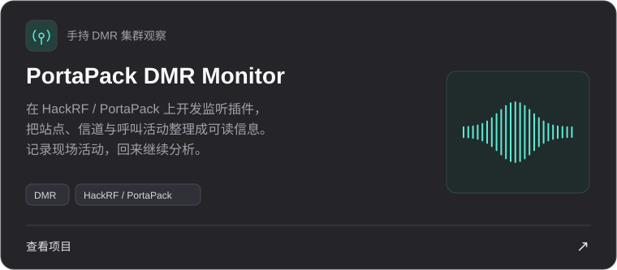
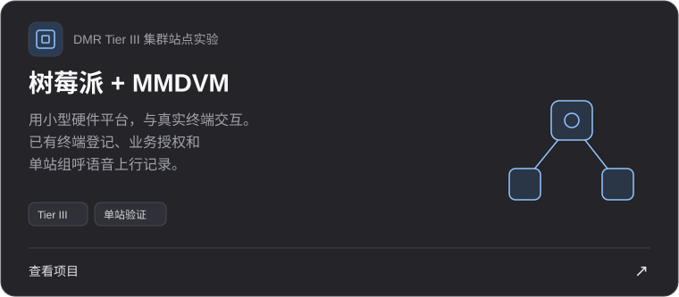
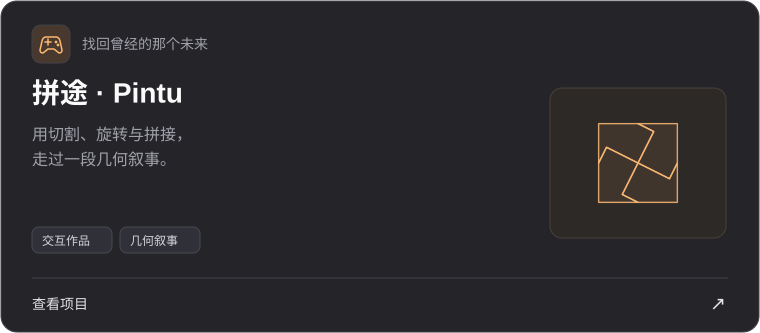

<picture>
  <source media="(max-width: 600px)" srcset="assets/header-mobile.svg" />
  
</picture>

[关于我](#关于我) · [正在折腾](#正在折腾) · [作品](#作品) · [一路走来](#一路走来) · [联系我](mailto:15048094700@163.com)

## 关于我

你好，我是天航。现在在上海理工大学读通信工程，也在酷爱科技实习，参与 **Simi / OrgOS** 相关工作。

从机器人、航模和最早的 Python 小程序，到无线电、家庭网络和软件项目，我一直喜欢亲手试一试。一个想法能不能运行、设备之间能不能连起来、做出来的东西用起来是否顺手，都会让我想继续琢磨。

这里放的是我的作品、尝试和兴趣。除了代码，我也喜欢摄影、视频剪辑和产品的视觉呈现。

## 正在折腾

### 📡 无线电与网络

业余无线电是我持续投入的兴趣。从数字中继、天馈与终端配置，到 SDR 观察和集群站点实验，关注点逐渐走向设备之间真正发生了什么。

目前最想展示的是 **HackRF / PortaPack 上的 DMR 监听插件**，以及 **树莓派 + MMDVM 集群站点实验**。家庭网络也是日常的一部分：R5S 软路由、DDNS、SMB 和自建服务，都是用着、调着慢慢积累下来的。

### 🧑‍💻 软件与 AI

在实习中接触 AI 应用与实际项目，也用 Claude Code、Codex 等工具辅助个人开发。对我来说，做软件既包括把功能做出来，也包括需求整理、原型设计、调试和后续改进。

尝试过 iOS 设备控制、OCR 日程工具和设备接入，也会把想法做成交互作品。编程和系统基础仍在持续学习，主页里的项目记录的是具体实践。

### 📷 产品与画面

做过景区系统的交互原型，也喜欢拍摄和剪辑。除了功能，我在意界面怎么组织、信息怎么表达，以及一个作品最终给人的感受。

## 作品

<a href="https://github.com/Cao150702/portapack-dmr-monitor">
<picture>
  <source media="(max-width: 600px)" srcset="assets/monitor-mobile.svg" />
  
</picture>
</a>

<a href="https://github.com/Cao150702/pi-mmdvm-trunking">
<picture>
  <source media="(max-width: 600px)" srcset="assets/station-mobile.svg" />
  
</picture>
</a>

<a href="https://github.com/Cao150702/pintu-public">
<picture>
  <source media="(max-width: 600px)" srcset="assets/pintu-mobile.svg" />
  
</picture>
</a>

## 工作台的其他角落

这些是以前做过或仍在继续的小尝试，也构成了我的兴趣轨迹。

- **家庭网络与自建服务**：R5S 软路由、DDNS、SMB，以及日常服务的部署、配置和调试。
- **iOS 设备控制**：尝试基于已有项目二次开发，探索 iOS 设备上的自动化操作。
- **OCR 日程工具**：使用 Xcode 开发 iOS 应用，尝试把屏幕内容识别用于日程整理。
- **设备接入**：实践过 Docker / MQTT / EMQX，用于设备接入与通信调试。
- **景区系统原型**：做过游客服务、设备监控、数据统计等模块的原型设计。
- **早期 Python 作品**：初中时写过二次根式化简程序，尝试将递归过程改写为非递归实现。

## 常用工具与学习

`Python` · `C` · `Git` · `Xcode` · `Docker` · `Axure` · `Claude Code` · `Codex`

会查英文技术文档和 API 手册，也会通过日志、实验和反复调试理解问题。工具是日常实践的一部分，通信、网络和编程的基础还在继续补齐。

## 一路走来

**2026.05 — 现在 · 酷爱科技实习**  
接触 AI 应用与实际项目，参与 Simi / OrgOS 相关工作。

**2025.09 — 现在 · 上海理工大学**  
本科在读，电子与信息类培养背景，学习通信相关知识，同时继续做个人项目。

**2023.07 — 2023.08 · 清华同衡实习**  
参与原型设计、项目资料整理与协作，接触实际项目的工作流程。

**更早一些 · 机器人、航模与编程**  
参加机器人、航海与航空模型、创意编程和科技创新活动。今天的很多兴趣，都是从那时延续下来的。

## 比赛与早期足迹

- **WER2017 世界锦标赛三等奖** · 机器人竞赛。
- **2018 年内蒙古自治区 WER 能力挑战赛小学组冠军**。
- **2020 年内蒙古自治区中小学电脑制作活动初中组人工智能二等奖**。
- **2024 年第 39 届呼伦贝尔市青少年科技创新大赛青少年创意编程一等奖**。

完整比赛与活动记录

| 时间 | 奖项 |
| --- | --- |
| 2024.12 | 第 39 届呼伦贝尔市青少年科技创新大赛青少年创意编程一等奖 |
| 2021.09 | 首届呼伦贝尔市青少年机器人竞赛 / 第二届呼伦贝尔市青少年创意编程与智能设计大赛 Python 创意编程初中组优秀奖 |
| 2020.11 | 海拉尔区第五中学第七届校园科技节科技创意作品竞赛一等奖 |
| 2020.10 | 2020 年呼伦贝尔市公民科学素质大赛优秀团队奖 |
| 2020.09 | 2020 呼伦贝尔市青少年航海、航空航天、车辆、建筑模型教育竞赛优胜奖 |
| 2020.08 | 2019-2020 学年度海五中“民族团结先进个人”称号 |
| 2020.07 | 第二届内蒙古自治区中小学电脑制作活动初中组人工智能二等奖 |
| 2020.06 | 第二届国际青少年编程竞赛金奖 |
| 2020.05 | 第 35 届内蒙古自治区青少年科技创新大赛青少年科技创新成果竞赛二等奖 |
| 2019.11 | 第三十五届呼伦贝尔市青少年科技创新大赛青少年科技创新成果（初中）个人一等奖 |
| 2019.10 | 2019 年海拉尔区第七届青少年科技创新大赛二等奖 |
| 2019.07 | 2019 年呼伦贝尔市青少年航空、航海车辆模型竞赛第一名 |
| 2019.06 | 2019 呼伦贝尔市航海模型、建筑模型教育竞赛一等奖、二等奖、优胜奖 |
| 2018.12 | 首届内蒙古自治区中小学生人工智能及创客教育装备技术应用创新实践活动机器人技能 WER 能力挑战赛小学组冠军 |
| 2018.07 | 2018 年全国青少年户外体育活动营地夏令营（完成全部学习任务） |
| 2018.05 | 第 18 届内蒙古自治区青少年机器人竞赛 WER 工程创新赛小学组二等奖 |
| 2017.11 | WER2017 赛季世界锦标赛三等奖 |
| 2017.08 | 全国航海模型运动竞赛一等奖、二等奖、优胜奖 |
| 2017.07 | 2017 年呼伦贝尔市青少年航海模型选拔赛小学组第二名、第三名 |

---

**欢迎聊无线电、聊作品，也聊还没做出来的想法。**

[15048094700@163.com](mailto:15048094700@163.com) · [@Cao150702](https://github.com/Cao150702)
